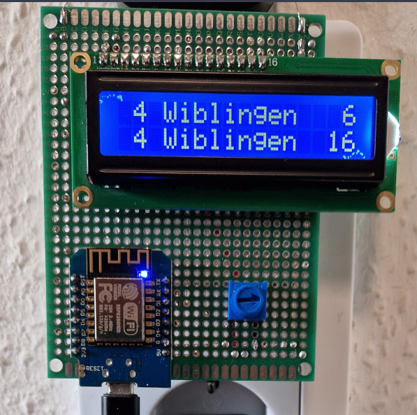

# Next bus arrival display
This little program runs on a D1 mini microcontroller and displays the next 2 bus arrivals for a given bus stop in the SWU transition network on a LCD1602 display.

 

# Hardware required:
* LCD1602 display
* D1 mini microcontroller
* Soldering 
* Potentiometer (50kΩ)* 1

# Wiring instructions
[https://www.instructables.com/LCD-1602-With-Arduino-Uno-R3/](https://www.instructables.com/LCD-1602-With-Arduino-Uno-R3/)